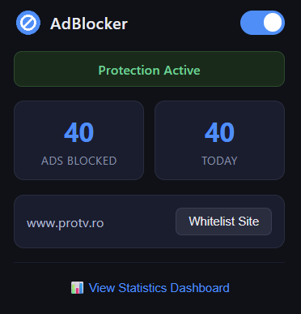
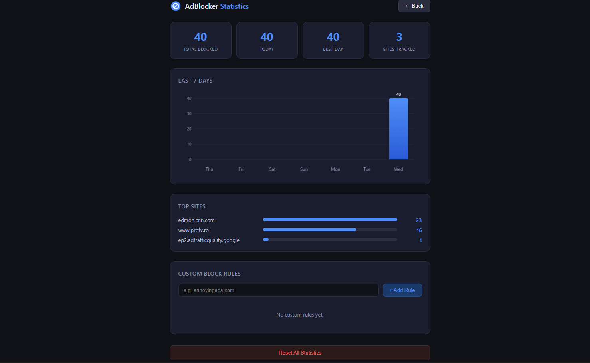

## adblocker-extension
Chrome MV3 ad blocker – thesis project

## Features
- Network-level ad blocking using declarativeNetRequest (260 rules)
- Popup UI with enable/disable toggle and live blocked ads counter
- Per site whitelist
- Cosmetic filtering to hide leftover ad containers
- JavaScript popup blocking
- Statistics dashboard with bar chart and per-site breakdown
- Custom user-defined block rules

 ## How to install
1. Clone this repo
2. Open Chrome → `chrome://extensions`
3. Enable Developer Mode
4. Click "Load unpacked" → select this folder

## Tech stack
- Vanilla JavaScript, HTML, CSS
- Chrome Extensions Manifest V3
- `declarativeNetRequest` API for network blocking
- `MutationObserver` for cosmetic filtering

## Screenshots

## Known Limitations
- First-party ads (e.g. Reddit promoted posts) cannot be blocked as they 
  are served from the same domain as the site content
- Aggressive piracy sites use obfuscated JavaScript that defeats 
  network level blocking

## AI Usage
Claude AI (claude.ai, Anthropic) was used as a development assistant 
during the implementation phase of this project (March-May 2026).